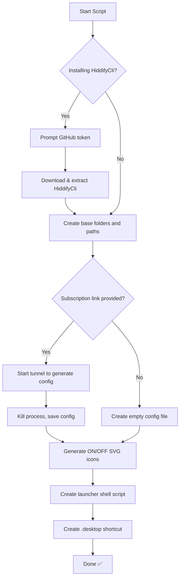

# 🧩 HiddifyCli Launcher (for Linux)

Easily switch and manage **HiddifyCli** VPN tunnels via desktop shortcuts on your Linux machine — all without touching the terminal every time.

## 🚀 About

This project was born out of pure convenience.

I frequently use [HiddifyCli](https://github.com/hiddify/hiddify-core) — a terminal-based VPN client — on Ubuntu. While it works like a charm, switching between configs or toggling it on/off felt clunky. So I built this tool to:

- ⚡ Quickly toggle HiddifyCli on/off.
- 🔀 Seamlessly switch between different configs with just a click.
- 🖼️ Automatically generate custom ON/OFF icons for each config.
- 🧼 Uninstall everything cleanly if needed.

It’s not some huge technical innovation — but it’s **damn handy**! Sharing it because maybe it helps someone else too.

---

## 🛠️ Features

- One-click desktop shortcuts for each Hiddify config
- Visual feedback (icon changes between on/off)
- Add unlimited configs
- Automatically handles stopping any previously running tunnel
- Full and partial uninstall options

---

## 📦 Installation

1. Clone this repo:
   ```bash
   git clone https://github.com/rezasadid753/hiddifycli-launcher.git
   cd hiddifycli-launcher
   ```

2. Run the installer script:
   ```bash
   chmod +x HiddifyCli_AutoInstaller.sh
   ./HiddifyCli_AutoInstaller.sh
   ```

3. Follow the prompts:
   - Choose a HiddifyCli version to install
   - Provide your config (or skip for an empty one)
   - Your desktop shortcut will be ready 🎉

---

## 🔧 Recommended Setup

- 📌 **Pin this app to your Dock** (Dash-to-Dock or similar) for quick access and faster status icon refresh.
- 🌐 **Optional but useful:** Install the [IP Finder](https://extensions.gnome.org/extension/2983/ip-finder/) GNOME extension by [LinxGem33](https://extensions.gnome.org/accounts/profile/LinxGem33). It shows your IP in the top bar, making it easy to check if the proxy is active.

---

## 🖱️ Usage

Each added config gets:
- A unique `.desktop` shortcut in `~/.local/share/applications`
- Matching ON/OFF SVG icons
- Log & PID tracking in `/tmp`

Click to toggle the VPN.
Switching configs auto-disables the previous one.

---

## 🧹 Uninstall Options

- **Full removal (everything):**
  ```bash
  ./HiddifyCli_AutoInstaller.sh --uninstall
  ```

- **Only remove saved configs and shortcuts:**
  ```bash
  ./HiddifyCli_AutoInstaller.sh --uninstall-configs
  ```

---

## 🧬 How It Works



---

## 📁 Directory Structure

```bash
~/HiddifyCli/
├── configs/         # JSON configs (config_*.json)
├── scripts/         # Toggle scripts (script_*.sh)
├── icons/           # ON/OFF SVGs for desktop entries
└── webui/           # WebUI from Hiddify
```

---

## 💡 Notes

- Icons and `.desktop` files live in `~/.local/share/applications`.
- VPN status is tracked using `/tmp/HiddifyCli_active`.
- Logs and PID files are stored in `/tmp`.

---

## 🤝 Acknowledgements

- [HiddifyCli](https://github.com/hiddify/hiddify-core) – The amazing VPN tool this project wraps around.
